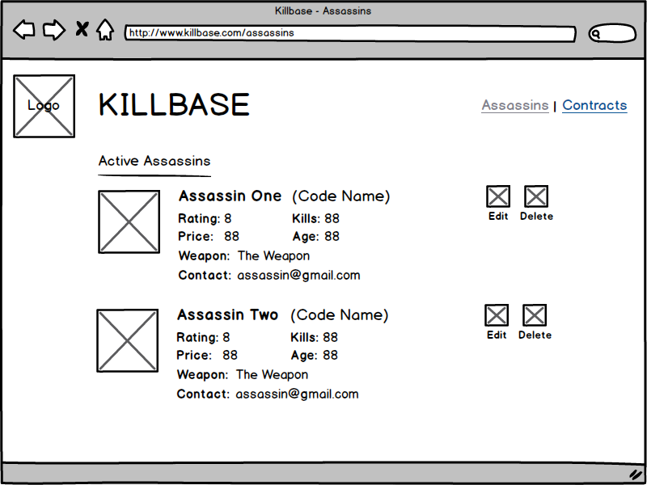
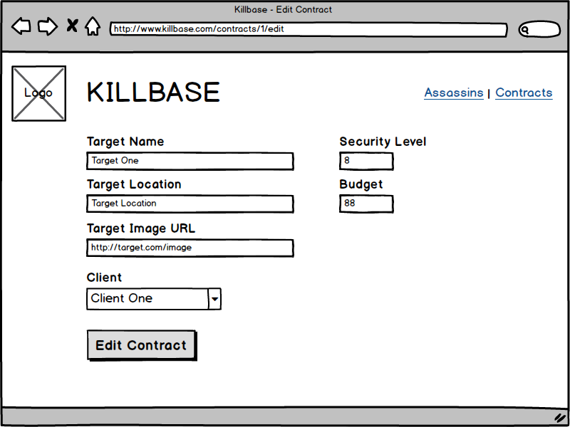

# Killbase

**Killbase** is a service that allows international assassins and their clients to create, book, and execute contracts. You are building a web app for them. It should allow you to:

* List assassins and contracts
* Add assassins and contracts
* Assign contracts to assassins
* Modify and remove assassins and contracts

There may be some additional features, such as search, that are nice-to-haves, but a lower priority than the core features. Focus on the basic CRUD actions. The good people at Killbase have provided you some sample data from their existing registry that you can use for development.

An example application can be found here: http://to.do/killbase

## Import stories into Issue Tracker

Import these user stories into a new project in the issue tracker of your choice. You may find it useful to prioritize the stories before you begin.

* As a user, I need to be able to identify the company (style/branding/logo)
* As a user, I need to be able to list all the assassins
* As a user, I need to be able to delete an existing assassin
* As a user, I need to be able to edit existing assassin
* As a user, I need to be able to link to a specific assassin
* As a user, I need to be able to list all the contracts
* As a user, I need to be able to easily navigate between assassins and contracts
* As a user, I need to be able to add a contract
* As a user, I need to be able to assign an assassin to a contract
* As a user, I need to be able to delete an existing contract
* As a user, I need to be able to edit existing contracts
* As a user, I need to be able to link to a specific contract
* As a user, I need to be able to link to a contract from an assassin.
* As a user, I need to be able to link to an assassin from a contract
* As a user, I need to be able to filter/sort assassins by price, kills, or rating
* As a user, I need to limit the number of assassin results I receive at a time
* As a user, I need to limit the number of contracts I receive at a time
* As a user, I need to search for assassins
* As a user, I need to be able to search for contracts
* As a user, I need to be able to search for active contracts
* As a user, I need to be able see the total number of assassins
* As a user, I need to be able to see the total number of contracts
* As a user, I need to be able to add a new assassin
* As a user, I need to be able to assign an assassin to a contract
* As a user, I need to be able to complete a contract
* As a user, I need to be able to remove an assassin from a contract

## Sample Data

Your app should accommodate and make use of all of the following sample data, which can be downloaded [here](data/assassins.csv) and [here](data/contracts.csv). **Note that the data is denormalized,** and will require some transformation to get into the database.

1) Create an entity relationship diagram for the tables in the killbase database.
2) Create the killbase database, and write the knex migrations to create all the tables.
3) Write the knex files to seed the database with the following information:

### Assassins

| Full Name        | Code Names              | Weapon                     | Contact Info           | Age | Price | Rating | Kills |
|------------------|-------------------------|----------------------------|------------------------|-----|-------|--------|-------|
| Alexander Duggan | The Jackal              | Sniper rifle               | jackal@gmail.com       | 31  | 45    | 7.5    | 28    |
| Anton Chigurh    | Old Man                 | Pneumatic bolt gun         | pneujackcity@gmail.com | 52  | 40    | 9      | 72    |
|                  | Ghost Dog               | Pistol                     | ghostdog@gmail.com     | 28  | 20    | 6.5    | 35    |
| Jason Bourne     |                         | Parkour                    | jb@gmail.com           | 27  | 25    | 7      | 48    |
| John Wick        | Baba Yaga               | Lots of guns               | babayaga@gmail.com     | 35  | 50    | 9.5    | 433   |
| Jules Winnfield  |                         | Pistol                     | bmf@gmail.com          | 26  | 15    | 6.5    | 13    |
| Leon             | The Professional        | Everything                 | leon@gmail.com         | 41  | 30    | 8.5    | 87    |
| Nikita Mears     | Nikita, La Femme Nikita | Silenced pistols           | nikita@gmail.com       | 28  | 30    | 7      | 32    |
| Pickle Rick      | Solenya                 | Lasers and office supplies | rsanchez@gmail.com     | 60  | 0     | 8      | 24    |

### Contracts

| Target Name       | Target Location   | Target Photo                    | Target Security | Client Name       | Budget |
|-------------------|-------------------|---------------------------------|-----------------|-------------------|--------|
| Butch Coolidge    | Los Angeles       | https://goo.gl/LCquZj           | 3               | Marcellus Wallace | 40     |
| The Jaguar        | Russian Embassy   | https://goo.gl/6JWsiv           | 9               | Concerto          | 70     |
| Norman Stansfield | Manhattan         | https://i.imgur.com/mdIk33E.jpg | 7               | Mathilda          | 35     |
| Santino D'Antonio | Continental Hotel | https://goo.gl/fUPkYy           | 10              | Winston           | 25     |
| Sonny Valerio     | Queens            | https://goo.gl/8DHYUS           | 4               | Ray Vargo         | 10     |

## Notes

* Use feature-branch workflows.
* Deploy your work.

## Wireframes

You can use these wireframes as a reference.

## How to Submit Your Assessment

Fork/clone this repo.
Add a README to your project that has:

* A link to your deployed site
* Link to your issue tracker
* Links to your repo with updated code
* A data model of the final data model of the project
